

# Waveform generation using DAC

# Introduction  
The Digital-to-Analog Converter (DAC) converts a digital value to an analog voltage. The DAC module offers flexible input source selection, provision to route output to other peripherals such as analog comparator and Analog to Digital converter, and configurable registers set.

DAC has a flexible option to choose both positive as well as negative reference voltage sources, depending on application requirement.

This demo example discusses how DAC peripheral from PIC18F Q10 family of microcontrollers, can be used to generate reference voltage and different signals.

# Related Documents / Useful Links

- [TB3238 - 5-Bit Digital-to-Analog Converter](https://www.microchip.com/DS90003238)
- [PIC18-Q10 Product Family Page](https://www.microchip.com/design-centers/8-bit/pic-mcus/device-selection/pic18f-q10-product-family)
- [PIC18F47Q10 Data Sheet](https://www.microchip.com/DS40002043)
- [PIC18F47Q10 Code Examples on GitHub](https://github.com/microchip-pic-avr-examples?q=pic18f47q10)

# Reference Voltage and Waveform Generation Using DAC
The signals generated in this example are “Sine wave, Triangular wave, Square wave, Sawtooth wave, and constant (reference) voltage signals”. The digital Look Up Table (LUT) is created and fed into DAC input to generate the corresponding signal.  

### The LUT is generated by considering following parameters-
1.  Constant (Reference) Voltage:
* 	 Voltage 1.6V
* 	 Voltage 3.0V

2.  Waveforms:
* 	Amplitude of the signal – 3.3V
* 	Frequency of the signal – 100Hz (DAC register update frequency can be modified by changing timer period to change the frequency of the generated signal.)

Figure 1 shows an overview of the Signal Generator Example.

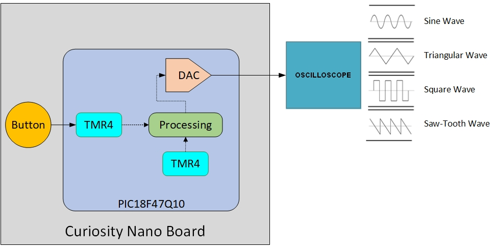

**Figure 1: Application Block Diagram**

The Signal Generator example is implemented using Curiosity Nano board with PIC18F47Q10, and oscilloscope is used to monitor the generated signals. 												

The onboard push button (SW0) is used to switch between the Constant voltage and various waveforms.

This example generates the reference voltage at power up, and the signal output will be changed after each switch press as per following sequence

1.	Reference voltage 1.6V (on Power up)
2.	Reference voltage 3V
3.	Sine Wave
4.	Triangular Wave
5.	Square Wave
6.	Sawtooth Wave

**Frequency calculation for the generated signal**

- When the signal to be generated is Sine wave, Triangular wave, Square wave or Sawtooth wave, frequency of the generated signal is decided by the DAC register update frequency and total number of points in one cycle of the signal.
- Timer 2 interrupt is used for updating the DAC register. 
- Frequency of the generated signal = 1/ (total number of points in one cycle * Timer 2 period) = 1/(128 * 78.13 us) = 100 Hz.
- For changing the frequency of the generated signal timer 2 period can be changed. 

***Note: The system clock frequency also has impact on the maximum frequency that can be generated using this method. 
For generating higher frequecy signal the higher system clock frequency should be used. 
With 64 MHz of system clock frequency the maximum frequency generated is 1.1 KHz.***

Operation of this example is discussed in following section.

# Hardware used
* [PIC18F47Q10 Curiosity Nano evaluation board](https://www.microchip.com/Developmenttools/ProductDetails/DM182029)

With full program and debug capabilities, the PIC18F47Q10 Curiosity Nano evaluation kit offers complete support for the new design. With the award-winning MPLAB X integrated development platform and MPLAB Code Configurator (MCC), the kit provides access to the Intelligent analog and Core Independent Peripherals on the PIC18F47Q10. Figure 2 shows the PIC18F47Q10 Curiosity Nano board.

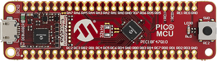

**Figure 2: PIC18F47Q10 Curiosity Nano board**

# Software Tools
Following Microchip’s free IDE, compiler and graphical code generators are used for the application firmware development.

* MPLAB® X IDE [v5.45 or newer](http://www.microchip.com/mplab/mplab-x-ide)
* MPLAB® XC8 Compiler [v2.31 or newer](http://www.microchip.com/mplab/compilers)
* MPLAB® Code Configurator (MCC) [v4.1.0 or newer](https://www.microchip.com/mplab/mplab-code-configurator)
* MPLAB® Melody Library [v1.37.17 or newer](https://www.microchip.com/mplab/mplab-code-configurator)
* MCC Device Libraries PIC10 / PIC12 / PIC16 / PIC18  MCUs [v1.81.7 or newer](https://www.microchip.com/mplab/mplab-code-configurator)
* Microchip PIC18F-Q Series Device Support [1.9.175 or newer](https://packs.download.microchip.com/)

# Hardware Setup
The following figures (Figure 3.1 and Figure 3.2) show the hardware connection details.

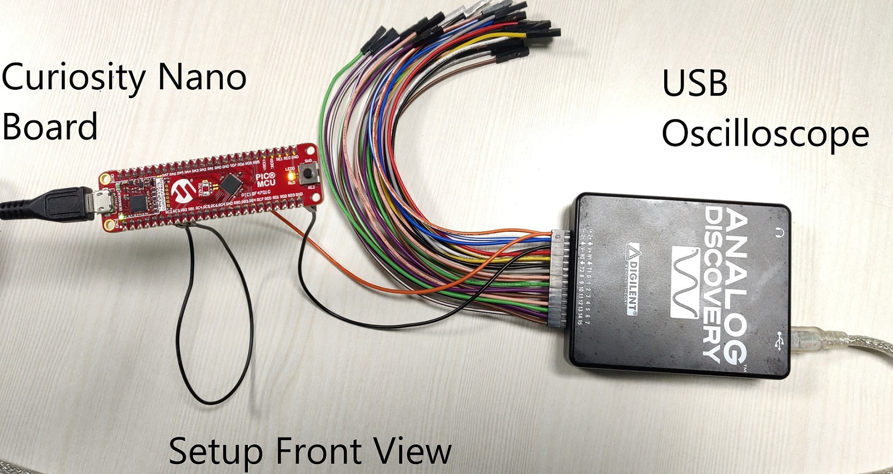

**Figure 3.1: Application Hardware Setup, Front View**																		

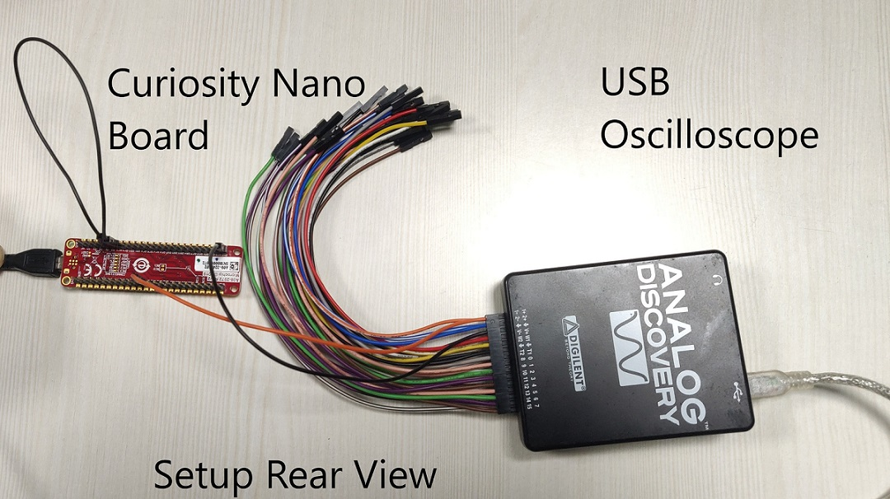

**Figure 3.2: Application Hardware Setup, Rear View**
# Peripheral configurations using MCC
## ->  Configure Clock

Open "Clock Control" setup present under "System" dropdown menu in "Project Resources" tab.

* Set "Clock Source" as "HFINTOSC"
* Set "HF Internal Clock" as "16_MHz"
* Set "Clock Divider" as "1"

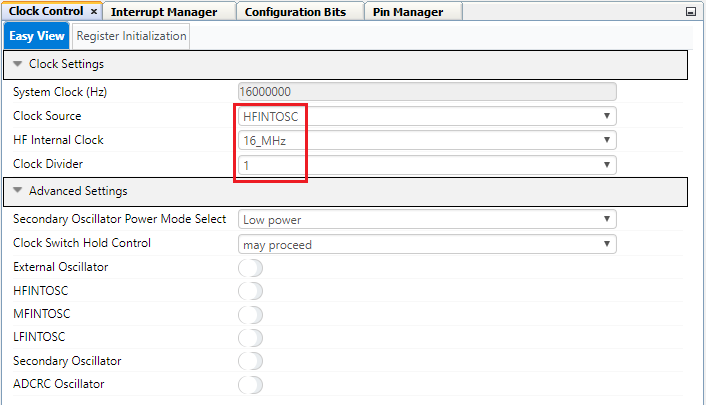

 **Figure 4: Clock Control**

*  **Add peripherals to the project**

Add DAC, TMR2 and TMR4 peripherals to the project from Device Resources → Drivers.

 **Figure 5: Peripherals**

## -> DAC configuration
The Digital to Analog Convertor module is used to convert digital Look Up Table into analog signal. DAC is configured as follows.  
* Set "VDD" as "3.3"
* Set "Required ref" as "1.6"
* Set "DAC Positive Reference" as "VDD"
* Set "DAC Negative Reference" as "VSS"
* Enable output on DACOUT1 i.e. DAC Output is connected to DAC1OUT1 pin of Microcontroller (RA2).

Figure 6 shows the DAC configuration using MCC.

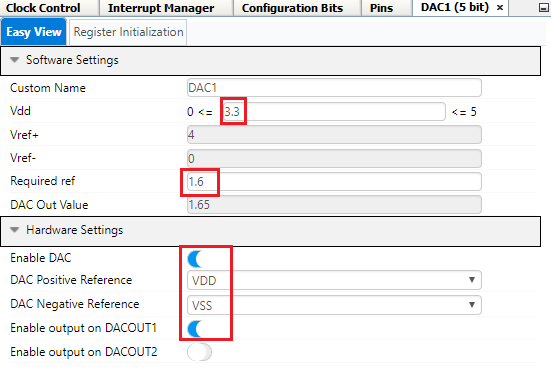

**Figure 6: DAC Configuration**

## -> TMR2 configuration
Timer 2 overflow interrupt is used to update DAC register when the signal to be generated is Sine wave, Triangular wave, Square wave or Sawtooth wave. Period of the timer 2 along with total number of points in one cycle of the signal, decides frequency of the generated signal.
TMR2 is configured as follows.  
* Set "Control mode" as "Roll over pulse"
* Set "Clock Source" as "FOSC/4"
* Set "Prescaler" as "1:8"
* Set "Timer period" as "78 us"
* Enable Timer interrupt.

Figure 7 shows the TMR2 configuration using MCC.

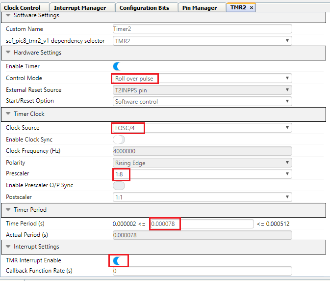

**Figure 7: TMR2 Configuration**

## -> TMR4 configuration
Timer 4 is used to implement the switch debounce for switch press and release event. 
TMR4 is configured as follows.  
* Set "Control mode" as "Monostable"
* Set "External Reset Source" as "T4INPPS pin"
* Set "Start/Reset Option" as "Starts on rising/falling edge on TMR4_ers"
* Set "Clock Source" as "LFINTOSC"
* Set "Prescaler" as "1:128"
* Set "Postscaler" as "1:2"
* Set "Timer period" as "50 ms"
* Enable Timer interrupt.

Figure 8 shows the TMR4 configuration using MCC.

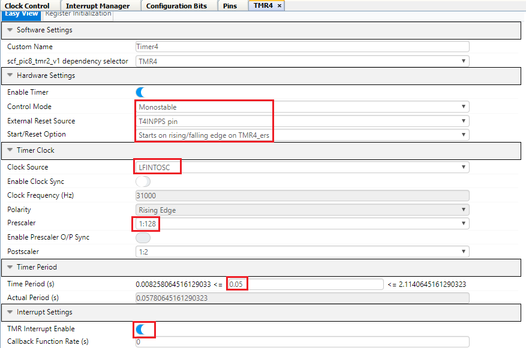

**Figure 8: TMR4 Configuration**

## ->  Pin Configuration
The I/O pin mapping of the PIC18F47Q10 MCU for the DAC, switch and on-board LED is shown in the Figure 9.

Configurations to be done in the Pins grid view window:
* Pin RA2 will be selected as DAC1OUT1 output pin.
* Select pin RC2 as TMR4 T4IN input pin.
* Select pins RE2 and RC2 as input pins. On-board switch SW0 is connected to pin RE2. Pins RE2 and RC2 are connected using jumper to use RC2 as T4IN pin.
* Configure Pin RE0 as output for connecting to LED.

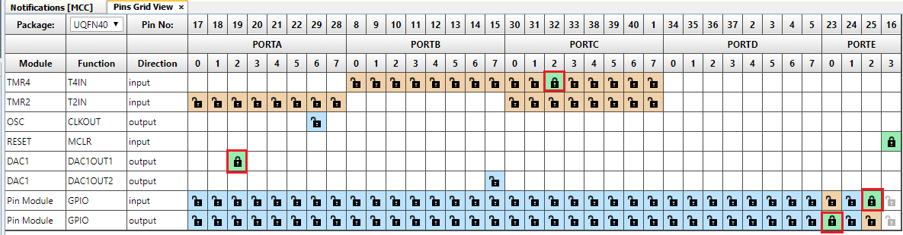

**Figure 9: Pins grid view**

Configurations to be done in the Pins window:
* Check the analog checkbox for RA2.
* Enable weak pull-up for RC2 and RE2 pins.
* Add custom name to the RE0 output pin as LED.

The I/O pin mapping of the PIC18F47Q10 MCU for DAC interface and Curiosity Nano on board LED is shown in Figure 10.

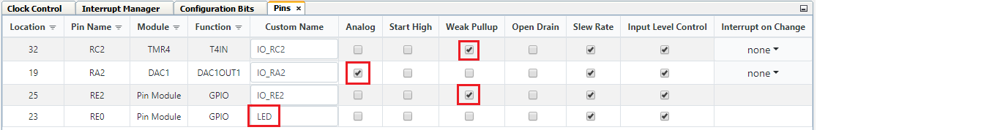

**Figure 10: Pins**

The on-board switch SW0 on the Curiosity Nano board is connected to RE2.  
As pin RE2 cannot be used as input pin for timer 4, pin RC2 is configured as timer 4 input pin for implementing switch debounce and generating an interrupt on switch press and release event. Pin RC2 is shorted to RE2 using external jumper.

# Demo Operation

* 	Setup the hardware, as per Hardware Setup (Refer Figure 3.1 and 3.2).
* 	Connect the pins RE2 and RC2 using the jumper.
* 	Connect RA2 (DAC1OUT1 Pin) to the positive terminal of the Scope (DSO/Oscilloscope) and connect GND (CNANO board ground pin) to GND terminal of scope.  
* 	Power on the CNANO board by connecting the micro USB cable from micro USB socket (Micro USB Connector) on the CNANO board to the PC USB socket.
*     Click on **Make and program device**.

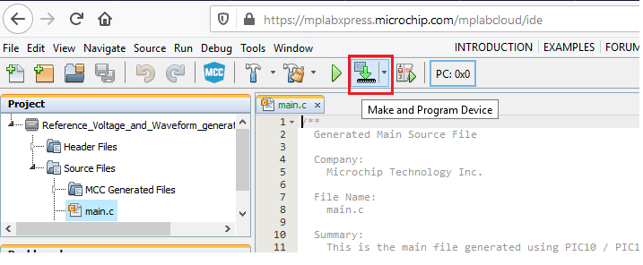

**Figure 11: Programing the device**

* 	Turn on the Oscilloscope.
* 	Observe the default constant signal (Reference Voltage 1.6V) on the oscilloscope screen.

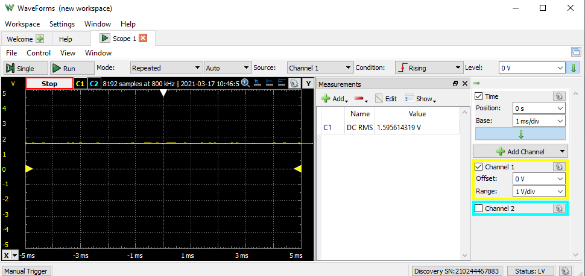

**Figure 12: Generated Reference voltage (1.6V) Signal on Oscilloscope screen**

* 	Press on board button (SW0) to change the generated signal and observe the constant 3.0V signal on the oscilloscope screen.

 **Figure 13: Generated Constant voltage (3.0V) Signal on Oscilloscope screen**

* 	Press on board button (SW0) to change the generated signal and observe the sine wave on the oscilloscope screen. 	

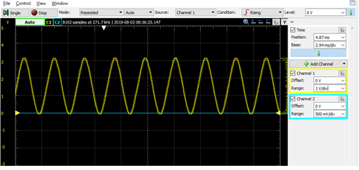

**Figure 14: Generated Sine Wave on Oscilloscope screen**

* 	Press on board button (SW0) to change the generated signal and observe the triangular wave on the oscilloscope screen. 								

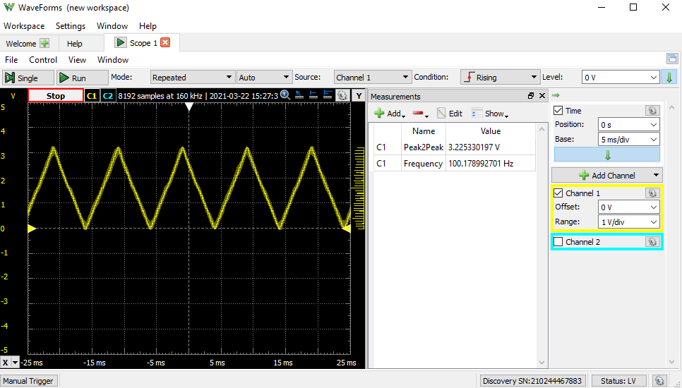

**Figure 15: Generated Triangular Wave on Oscilloscope screen**

* 	Press on board button (SW0) to change the generated signal and observe the square wave on the oscilloscope screen.

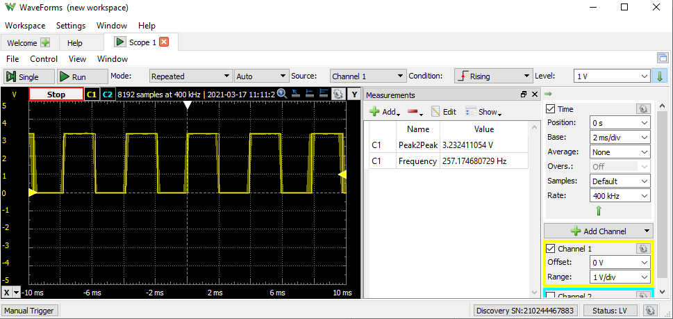

**Figure 16: Generated Square Wave on Oscilloscope screen**

* 	Press on board button (SW0) to change the generated signal and observe the sawtooth wave on the oscilloscope screen. 						

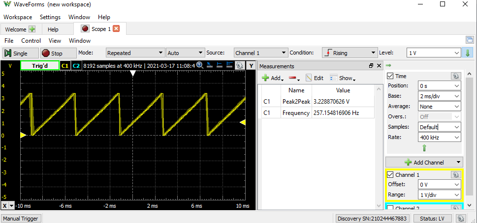

**Figure 17: Generated Sawtooth Wave on Oscilloscope screen**

* 	Press on board button (SW0) to change the generated signal and observe the default constant signal on the oscilloscope screen.
* 	Cycle is repeated, once six signals are generated and displayed.
* 	The signal change happens for every button (SW0) press.  

# Conclusion
This example illustrates reference voltage generation and signal generator implementation using Digital to Analog Converter (DAC) peripheral of 8-Bit PIC MCU.

Configurations like Reference Voltage generation, Signal generation using DAC, DAC output as ADC input, DAC output as Non-inverting input to the Analog Comparator can be implemented using flexible 5-Bit DAC peripheral of the PIC MCU.
