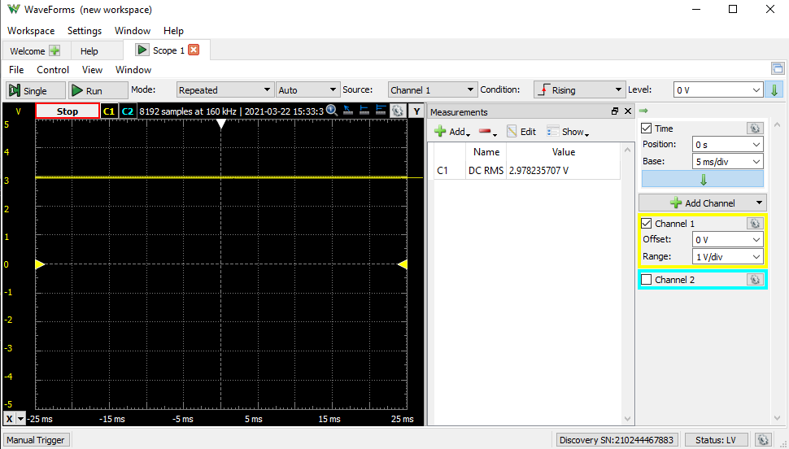
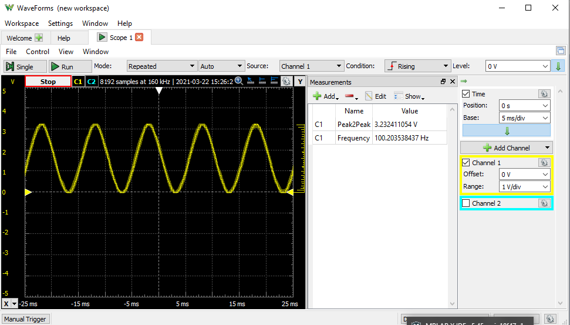
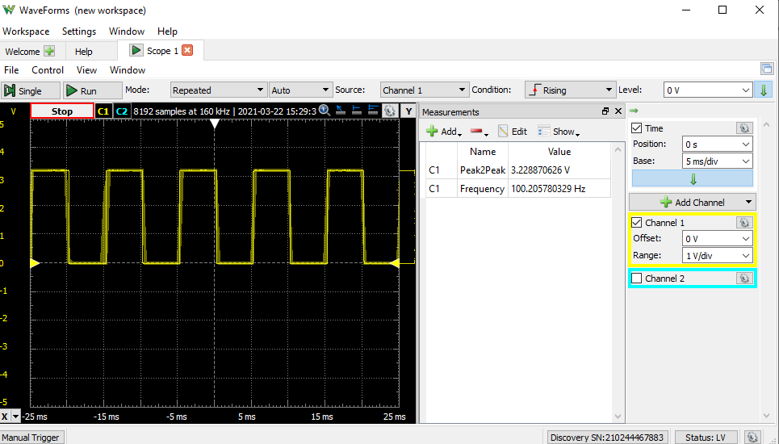

# Waveform generation using DAC

# Introduction  
The Digital-to-Analog Converter (DAC) converts a digital value to an analog voltage. The DAC module offers flexible input source selection, provision to route output to other peripherals such as analog comparator and Analog to Digital converter, and configurable registers set.

DAC has a flexible option to choose both positive as well as negative reference voltage sources, depending on application requirement.

This demo example discusses how DAC peripheral from PIC18F Q10 family of microcontrollers, can be used to generate reference voltage and different signals.

# Related Documents / Useful Links

- [TB3238 - 5-Bit Digital-to-Analog Converter](https://www.microchip.com/DS90003238)
- [PIC18-Q10 Product Family Page](https://www.microchip.com/design-centers/8-bit/pic-mcus/device-selection/pic18f-q10-product-family)
- [PIC18F47Q10 Data Sheet](https://www.microchip.com/DS40002043)
- [PIC18F47Q10 Code Examples on GitHub](https://github.com/microchip-pic-avr-examples?q=pic18f47q10)

# Reference Voltage and Waveform Generation Using DAC
The signals generated in this example are “Sine wave, Triangular wave, Square wave, Sawtooth wave, and constant (reference) voltage signals”. The digital Look Up Table (LUT) is created and fed into DAC input to generate the corresponding signal.  

### The LUT is generated by considering following parameters-
1.  Constant (Reference) Voltage:
* 	 Voltage 1.6V
* 	 Voltage 3.0V

2.  Waveforms:
* 	Amplitude of the signal – 3.3V
* 	Frequency of the signal – 250Hz (The Example demonstrates signal frequency as constant parameter.  Firmware source code can be modified to change the frequency of signal.)

Figure 1 shows an overview of the Signal Generator Example.

**Figure 1: Application Block Diagram**

The Signal Generator example is implemented using Curiosity Nano board with PIC18F47Q10, and oscilloscope is used to monitor the generated signals. 												

The onboard push button (SW0) is used to switch between the Constant voltage and various waveforms.

This example generates the reference voltage at power up, and the signal output will be changed after each switch press as per following sequence

1.	Reference voltage 1.6V (on Power up)
2.	Reference voltage 3V
3.	Sine Wave
4.	Triangle Wave
5.	Square Wave
6.	Sawtooth Wave

Operation of this example is discussed in following section.

# Hardware used
* [PIC18F47Q10 Curiosity Nano evaluation board](https://www.microchip.com/Developmenttools/ProductDetails/DM182029)

With full program and debug capabilities, the PIC18F47Q10 Curiosity Nano evaluation kit offers complete support for the new design. With the award-winning MPLAB X integrated development platform and MPLAB Code Configurator (MCC), the kit provides access to the Intelligent analog and Core Independent Peripherals on the PIC18F47Q10. Figure 2 shows the PIC18F47Q10 Curiosity Nano board.

**Figure 2: PIC18F47Q10 Curiosity Nano board**

# Software Tools
Following Microchip’s free IDE, compiler and graphical code generators are used for the application firmware development.

* [MPLAB® X IDE v5.45](http://www.microchip.com/mplab/mplab-x-ide)
* [XC8 Compiler v2.31](http://www.microchip.com/mplab/compilers)
* [MPLAB® Code Configurator (MCC) v4.1.0](https://www.microchip.com/mplab/mplab-code-configurator)
* [MPLAB® Code Configurator Library (CCL) v1.37.14](https://www.microchip.com/mplab/mplab-code-configurator)
* [MCC Device Libraries PIC10 / PIC12 / PIC16 / PIC18  MCUs v1.81.7](https://www.microchip.com/mplab/mplab-code-configurator)
* [Microchip PIC18F-Q Series Device Support 1.9.175](https://packs.download.microchip.com/)

***Note: For running the demo, the installed tool versions should be the same or later. This example is not tested with previous versions.***

# Hardware Setup
The following figures (Figure 3.1 and Figure 3.2) show the hardware connection details.

**Figure 3.1: Application Hardware Setup, Front View**																		

**Figure 3.2: Application Hardware Setup, Rear View**
# Peripheral configurations using MCC
## ->  Configure Clock

Open "Clock Control" setup present under "System" dropdown menu in "Project Resources" tab.

* Set "Clock Source" as "HFINTOSC"
* Set "HF Internal Clock" as "4_MHz"
* Set "Clock Divider" as "1"

 **Figure 4: Clock Control**

Click on the Configuration Bits tab under Project Resources → System tab for changing the default configuration bit settings.

Select "WDT Operating Mode" from CONFIG3L register as "WDT Disabled" to disable the watchdog timer.

## ->  Configure Configuration Bits

 **Figure 5: Configuration Bits**

*  **Add peripherals to the project**

Add DAC peripherals to the project from Device Resources → Drivers.

 **Figure 6: Peripherals**

## -> DAC configuration
The Digital to Analog Convertor module is used to convert digital Look Up Table into analog signal. DAC is configured as follows.  
* Set "VDD" as "3.3"
* Set "Required ref" as "1.6"
* Set "Clock Divider" as "1"
* Set "DAC Positive Reference" as "VDD"
* Set "DAC Negative Reference" as "VSS"
* Enable output on DACOUT1 i.e. DAC Output is connected to DAC1OUT1 pin of Microcontroller (RA2).

Figure 7 shows the DAC configuration using MCC.

**Figure 7: DAC Configuration**

## ->  Pin Configuration
The I/O pin mapping of the PIC18F47Q10 MCU for the DAC and on-board LED is shown in the Figure 8.

Configurations to be done in the Pin Manager grid view window:
* Pin RA2 will be selected as DAC1OUT1 output pin.
* Select pins RE2 and RC2 as input pins. On-board switch SW0 is connected to pin RE2.
* Configure Pin RE0 as output for connecting to LED.

**Figure 8: Pin Manager grid view**

Configurations to be done in the Pin Manager window:
* Check the analog checkbox for RA2.
* Enable weak pull-up for RC2 and RE2 pins.
* Set Interrupt on change for RC2 to positive.
* Add custom name to the RE0 output pin as LED.

The I/O pin mapping of the PIC18F47Q10 MCU for DAC interface and Curiosity Nano on board LED is shown in Figure 9.

**Figure 9: Pin Manager**

The on-board switch SW0 on the Curiosity Nano board is connected to RE2.  As external interrupt configuration is not possible on pin RE2, pin RC2 is configured to generate an Interrupt on Change (IOC) on positive edge. Pin RC2 is shorted to RE2 using external jumper for detecting button press event using IOC feature.

# Demo Operation

* 	Setup the hardware, as per Hardware Setup (Refer Figure 3.1 and 3.2).
* 	Connect the pins RE2 and RC2 using the jumper.
* 	Connect RA2 (DAC1OUT1 Pin) to the positive terminal of the Scope (DSO/Oscilloscope) and connect GND (CNANO board ground pin) to GND terminal of scope.  
* 	Power on the CNANO board by connecting the micro USB cable from micro USB socket (Micro USB Connector) on the CNANO board to the PC USB socket.
* 	The Curiosity Nano board should appear as a Mass Storage Device after connecting to the PC.
*  Click on **Make and program device**.

**Figure 10: Programing the device**

* 	Turn on the Oscilloscope.
* 	Observe the default Constant signal (Reference Voltage 1.6V) on the Oscilloscope screen.

**Figure 11: Generated Reference voltage (1.6V) Signal on Oscilloscope screen**

* 	Press on board button (SW0) to change the generated signal and observe the constant 3.0 volts signal on the Oscilloscope screen.

 **Figure 12: Generated Constant voltage (3.0V) Signal on Oscilloscope screen**

* 	Press on board button (SW0) to change the generated signal and observe the Sine wave on the Oscilloscope screen. 	

**Figure 13: Generated Sine Wave on Oscilloscope screen**

* 	Press on board button (SW0) to change the generated signal and observe the Triangular wave on the Oscilloscope screen. 								

**Figure 14: Generated Triangle Wave on Oscilloscope screen**

* 	Press on board button (SW0) to change the generated signal and observe the Square wave on the Oscilloscope screen.

**Figure 15: Generated Square Wave on Oscilloscope screen**

* 	Press on board button (SW0) to change the generated signal and observe the Saw tooth wave on the Oscilloscope screen. 						

**Figure 16: Generated Sawtooth Wave on Oscilloscope screen**

* 	Press on board button (SW0) to change the generated signal and observe the default Constant signal on the Oscilloscope screen.
* 	Cycle is repeated, once six signals are generated and displayed.
* 	The signal change happens for every button (SW0) press.  

# Conclusion
This example illustrates reference voltage generation and signal generator implementation using Digital to Analog Converter (DAC) peripheral of 8-Bit PIC MCU.

Configurations like Reference Voltage generation, Signal generation using DAC, DAC output as ADC input, DAC output as Non-inverting input to the Analog Comparator can be implemented using flexible 5-Bit DAC peripheral of the PIC MCU.
