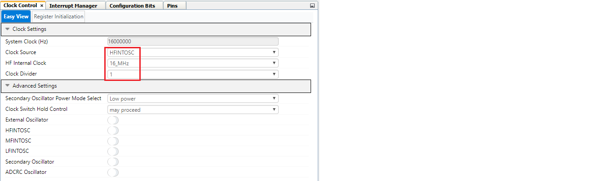
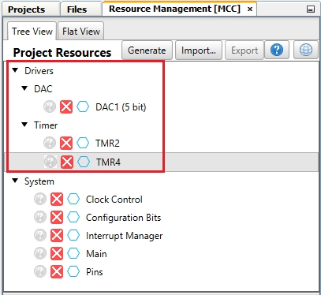
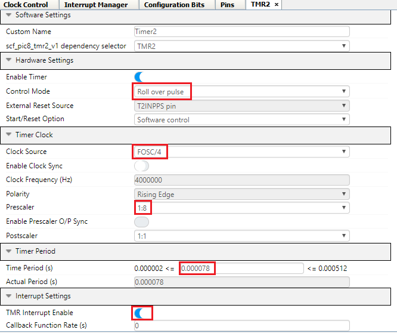
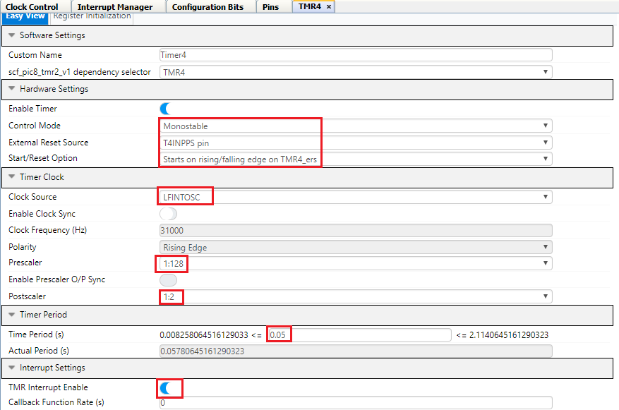
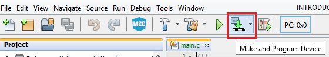
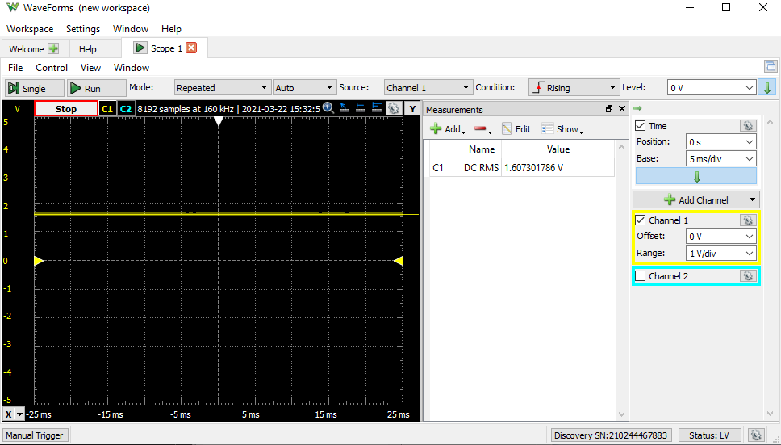
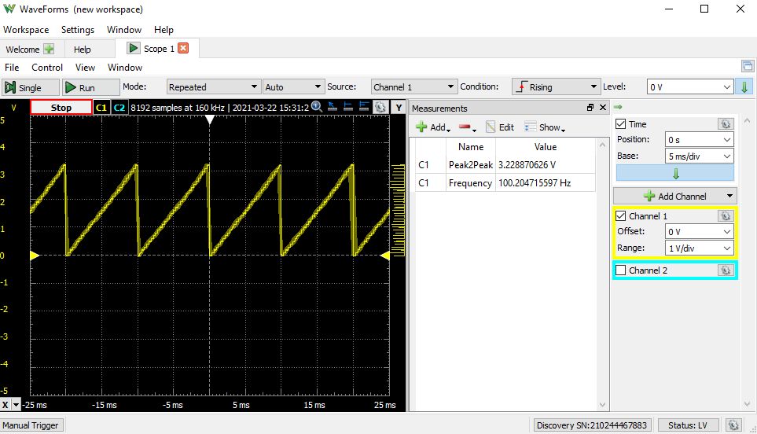

# Waveform Generation Using a DAC for the PIC18F47Q10 Microcontroller

# Introduction  
The DAC module offers a large variety of input sources, and the module output can be internally connected to other peripherals, such as Analog Comparator (AC), Analog-to-Digital Converter (ADC) and configurable registers set.

Using this DAC, both positive and negative reference voltage sources can be selected, depending on the application requirement.

This demo example discusses how DAC peripheral of PIC18-Q10 family of microcontrollers, can be used to generate reference voltage and different signals.

# Related Documents / Useful Links

* [TB3238 - 5-Bit Digital-to-Analog Converter](https://www.microchip.com/DS90003238)
* [PIC18-Q10 Product Family Page](https://www.microchip.com/design-centers/8-bit/pic-mcus/device-selection/pic18f-q10-product-family)
* [PIC18F47Q10 Data Sheet](https://www.microchip.com/DS40002043)
* [PIC18F47Q10 Code Examples on GitHub](https://github.com/microchip-pic-avr-examples?q=pic18f47q10)

# Reference Voltage and Waveform Generation Using DAC
The signals generated in this example are: sine wave, triangular wave, square wave, sawtooth wave and  constant (reference) voltage signals. The digital Look-up Table (LUT) is created and fed into DAC input to generate the corresponding signal.  

### The LUT is Generated by Considering the Following Parameters:
1.  Constant (Reference) Voltage:
* Voltage 1.6V
* Voltage 3.0V

2.  Waveforms:
* Amplitude of the signal – 3.3V
* Frequency of the signal – 100 Hz (the DAC register update frequency can be modified by updating the timer's period in order to change the frequency of the generated signal)

Figure 1 shows an overview of the signal generator example.

 Figure 1: Application Block Diagram

This example is implemented using the Curiosity Nano board with a PIC18F47Q10 and an oscilloscope is used to monitor the generated signals. 												

The button on the board (SW0) is used to switch between the constant voltage and various waveforms.

This example generates the reference voltage at Power-Up, and the signal output will be changed after each press according to this sequence:

1.  Reference voltage 1.6V (on Power-Up).
2.	Reference voltage 3V.
3.	Sine Wave.
4.	Triangular Wave.
5.	Square Wave.
6.	Sawtooth Wave.

**Frequency Calculation for the Generated Signal**

When the generated signal is a Sine wave, Triangular wave, Square wave or Sawtooth wave, the frequency of the signal is decided by the DAC register update frequency and by the total number of points in one cycle of the signal.

Timer2 is used to update the DAC register.

Frequency of the generated signal = 1/ (total number of points in one cycle X Timer2 period) = 1/(128X78.13 us) = 100 Hz.

For changing the frequency of the generated signal the Timer2 period can be changed.

***Note: The system clock frequency has an impact on the maximum frequency that can be generated using this method. For generating a higher frequency signal, a higher system clock frequency must be used. With 64 MHz of system clock frequency, the maximum frequency generated is 1.1 kHz.***

Operation of this example is discussed in the following section.

# Hardware used
* [PIC18F47Q10 Curiosity Nano evaluation board](https://www.microchip.com/Developmenttools/ProductDetails/DM182029)

With full program and debug capabilities, the PIC18F47Q10 Curiosity Nano evaluation kit offers complete support for the new design. With MPLAB X integrated development platform and MPLAB Code Configurator (MCC), the kit provides access to the Intelligent analog and Core Independent Peripherals on the PIC18F47Q10. Figure 2 shows the PIC18F47Q10 Curiosity Nano board.

 Figure 2: PIC18F47Q10 Curiosity Nano Board

# Software Tools
Following Microchip’s free IDE, compiler and graphical code generators are used for the application firmware development.

* MPLAB® X IDE [v6.05 or newer](http://www.microchip.com/mplab/mplab-x-ide)
* MPLAB® XC8 Compiler [v2.41 or newer](http://www.microchip.com/mplab/compilers)
* MPLAB® Code Configurator (MCC) [v5.2.2 or newer](https://www.microchip.com/mplab/mplab-code-configurator)
* Microchip PIC18F-Q Series Device Support [1.15.360 or newer](https://packs.download.microchip.com/)

# Hardware Setup
The following figures (Figure 3.1 and Figure 3.2) show the hardware connection details.

 Figure 3.1: Application Hardware Setup, Front View													

 Figure 3.2: Application Hardware Setup, Rear View

# Peripheral Configuration Using MCC
## Configure the Clock

Open the **Project Resources** tab then click System and Clock Control.

* Set "Clock Source" as "HFINTOSC"
* Set "HF Internal Clock" as "16_MHz"
* Set "Clock Divider" as "1"

 Figure 4: Clock Control

## Add Peripherals to the Project

Add DAC, TMR2 and TMR4 peripherals to the project from *Device Resources > Drivers*.

 Figure 5: Peripherals

## DAC Configuration
The Digital-to-Analog Convertor module is used to convert digital Look-up Table into analog signal. Configuration for DAC:
* Set "Vdd" as "3.3"
* Set "Required ref" as "1.6"
* Set "DAC Positive Reference" as "VDD"
* Set "DAC Negative Reference" as "VSS"
* Enable output on DACOUT1 because DAC Output is connected to DAC1OUT1 pin of Microcontroller (RA2)

Figure 6 shows the DAC configuration using MCC.

 Figure 6: DAC Configuration

## TMR2 Configuration
Timer 2 overflow interrupt is used to update DAC register when the signal to be generated is Sine wave, Triangular wave, Square wave or Sawtooth wave. The period of the Timer2 along with the total number of points in one cycle of the signal decides the frequency of the generated signal.
TMR2 is configured as follows:
* Set "Control mode" as "Roll over pulse"
* Set "Clock Source" as "FOSC/4"
* Set "Prescaler" as "1:8"
* Set "Timer period" as "78 us"
* Enable Timer interrupt

Figure 7 shows the TMR2 configuration using MCC.

 Figure 7: TMR2 Configuration

## TMR4 Configuration
Timer 4 is used to implement the switch debounce for switch press and release event.
TMR4 is configured as follows:  
* Set "Control mode" as "Monostable"
* Set "External Reset Source" as "T4INPPS pin"
* Set "Start/Reset Option" as "Starts on rising/falling edge on TMR4_ers"
* Set "Clock Source" as "LFINTOSC"
* Set "Prescaler" as "1:128"
* Set "Postscaler" as "1:2"
* Set "Timer period" as "50 ms"
* Enable Timer interrupt

Figure 8 shows the TMR4 configuration using MCC.

 Figure 8: TMR4 Configuration

## Pin Configuration
The Input/Output (I/O) pin mapping of the PIC18F47Q10 MCU for the DAC, switch and on-board LED is shown in the Figure 9.

Configuration done in the Pins grid view window:
* Pin RA2 will be selected as DAC1OUT1 output pin
* Select pin RC2 as TMR4 T4IN input pin
* Select pins RE2 and RC2 as input pins. On-board switch SW0 is connected to pin RE2. Pins RE2 and RC2 are connected by a jumper to use RC2 as T4IN pin.
* Configure Pin RE0 as output for connecting to LED

 Figure 9: Pins Grid View

Configurations to be done in the Pins window:
* Check the analog checkbox for RA2
* Enable Weak Pull-up for RC2 and RE2 pins
* Add custom name to the RE0 output pin as LED

The I/O pin mapping of the PIC18F47Q10 MCU for DAC interface and Curiosity Nano on board LED is shown in Figure 10.

 Figure 10: Pins

The on-board switch SW0 on the Curiosity Nano board is connected to RE2.  
Pin RE2 cannot be used as an input pin for Timer4 so pin RC2 is used for the timer to implement the switch debounce and to generate an interrupt on switch press and release event. Pin RC2 is shorted to RE2 using an external jumper.

# Demo Operation

* Set up the hardware according to Hardware Setup (refer to figures 3.1 and 3.2)
* Connect the pins RE2 and RC2 using the jumper
* Connect RA2 (DAC1OUT1 Pin) to the positive terminal of the Scope (DSO/Oscilloscope) and connect GND (CNANO board ground pin) to GND terminal of scope
* Power up the CNANO board by connecting the micro USB cable on the CNANO board to the PC USB socket
* Click on "Make and Program Device"

 Figure 11: Programing the Device  

* Turn on the oscilloscope
* Observe the default constant signal (reference voltage 1.6V) on the oscilloscope screen

 Figure 12: Generated Reference voltage (1.6V) Signal on the Oscilloscope Screen

* Press the button on the board (SW0) to change the generated signal and observe the constant 3.0V signal on the oscilloscope screen

 Figure 13: Generated Constant voltage (3.0V) Signal on the Oscilloscope Screen

* Press the button on the board (SW0) to change the generated signal and observe the sine wave on the oscilloscope screen

 Figure 14: Generated Sine Wave on the Oscilloscope Screen

* Press the button on the board (SW0) to change the generated signal and observe the triangular wave on the oscilloscope screen 								

 Figure 15: Generated Triangular Wave on the Oscilloscope Screen

* Press the button on the board (SW0) to change the generated signal and observe the square wave on the oscilloscope screen

 Figure 16: Generated Square Wave on the Oscilloscope Screen

* Press the button on the board (SW0) to change the generated signal and observe the sawtooth wave on the oscilloscope screen 						

 Figure 17: Generated Sawtooth Wave on the Oscilloscope Screen

* Press the button on the board (SW0) to change the generated signal and observe the default constant signal on the oscilloscope screen
* Cycle is repeated once six signals are generated and displayed
* The signal change happens for every button (SW0) press

# Conclusion
This example illustrates the reference voltage generation and the signal generator implementation using the Digital-to-Analog Converter (DAC) peripheral of an 8-Bit PIC MCU.

The 5-bit DAC peripheral of the PIC MCU offers a great amount of flexibility, by offering the possibility of implementing various types of configurations such as: reference voltage generation, signal generation using DAC, DAC output as ADC input or a DAC output as a non-inverting input for the AC.
